# Sigfox - Microsoft Azure integration
This tutorial explains how to communicate between a Sigfox device and Microsoft Azure IOT platform, as well as PowerBI for analytics.

## 1. Requirements
- Sigfox device registered on the network
- subscription to Microsoft Azure (free trial account is sufficient)
- PowerBI account

## 2. SmartEverything Arduino code (optional)
If you have a SmartEverything board, you can use the Arduino code in the repository. Temperature and Humidity will be reported everytime the Reset button is pressed.
Telit library is being used in this example.

## 3. Azure IOT Hub initial setup
Connect to https://portal.azure.com and add a new IOT Hub instance.
Create a new Resource-Group for the setup:
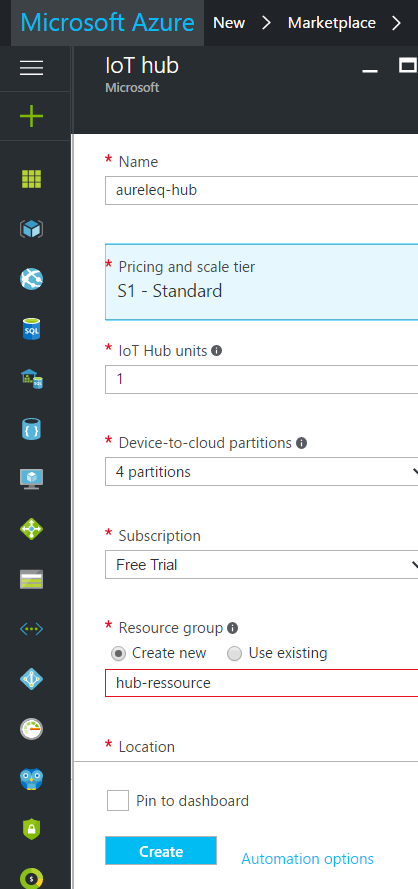

Once the instance has been completed, go into "Settings -> Shared Access Policies":
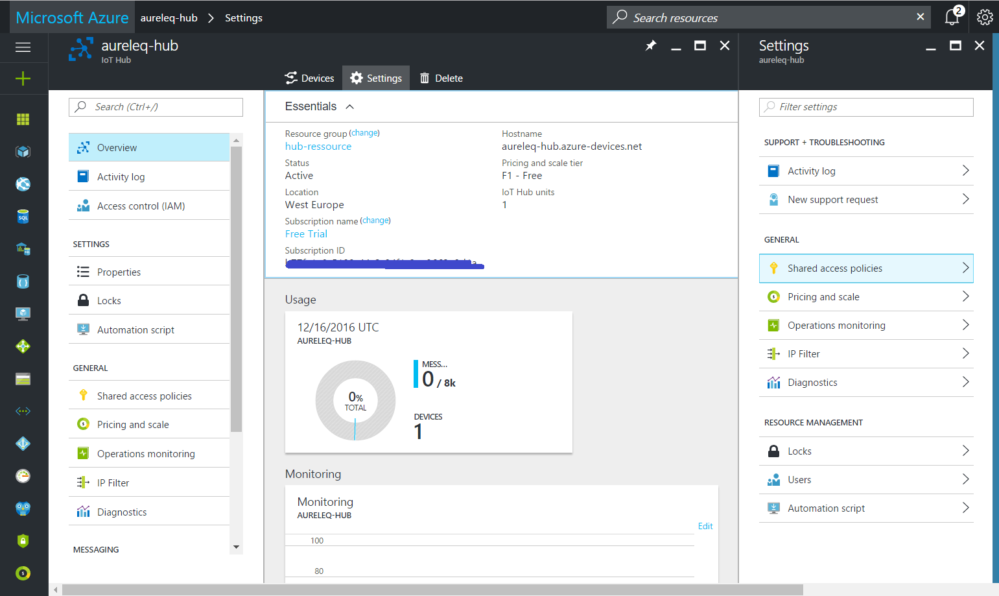

Copy the Connection String primary key, the string will have to be copied into Sigfox backend:
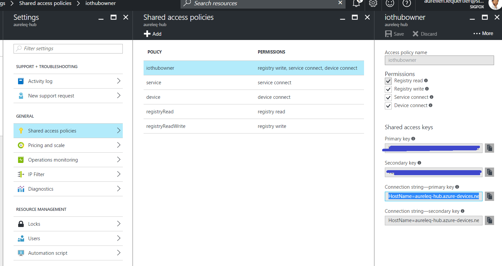

## 4. Sigfox callback configuration
Connect to your Arduino backend account and select the device type to be configured.
Under Callbacks category, add a new callback and select Microsoft Azure IOT Hub:
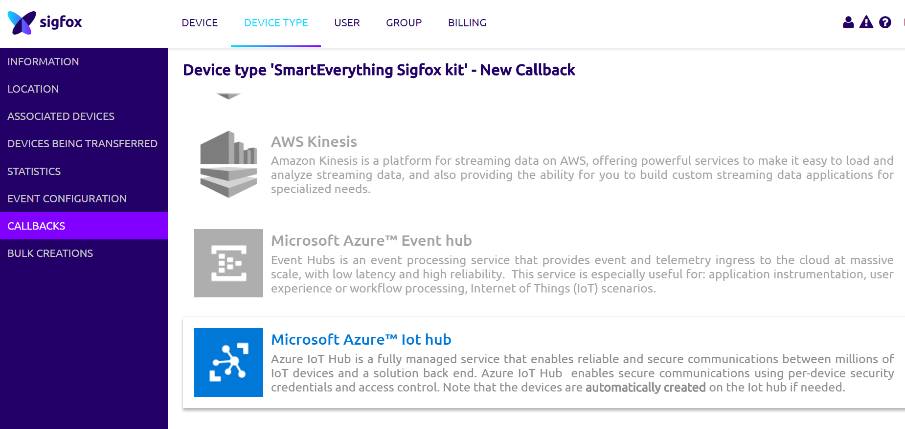

Add the previously copied Azure Connection String:
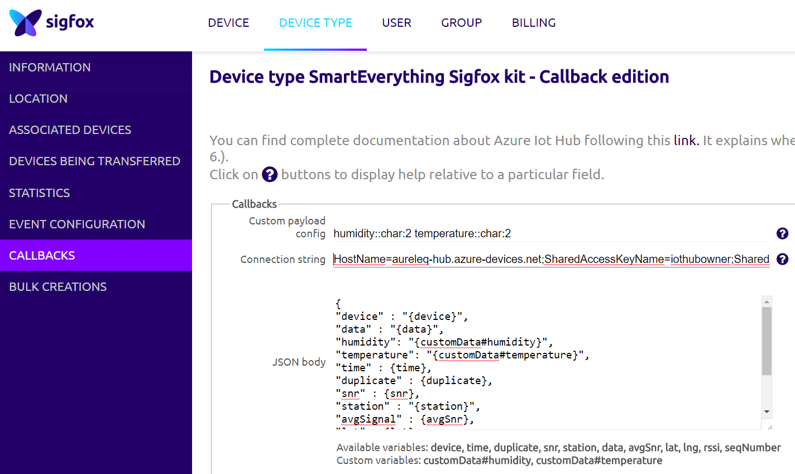

Using the SmartEverything board, humidity and temperature are reported in a string format (2 bytes for each report). You can use the following custom payload and JSON body in the callback configuration:

`humidity::char:2 temperature::char:2`

```json
{
"device" : "{device}",
"data" : "{data}",
"humidity": "{customData#humidity}",
"temperature": "{customData#temperature}",
"time" : "{time}",
"duplicate" : "{duplicate}",
"snr" : "{snr}",
"station" : "{station}",
"avgSignal" : "{avgSnr}",
"lat" : "{lat}",
"lng" : "{lng}",
"rssi" : "{rssi}",
"seqNumber" : "{seqNumber}"
}
```

If your callback configuration is correct, the number of monitored messages on your IOT Hub dashboard should increase when the device communicates.

## 5. Configure Stream Analytics
Back on the Azure portal, add a Stream Analytics instance:
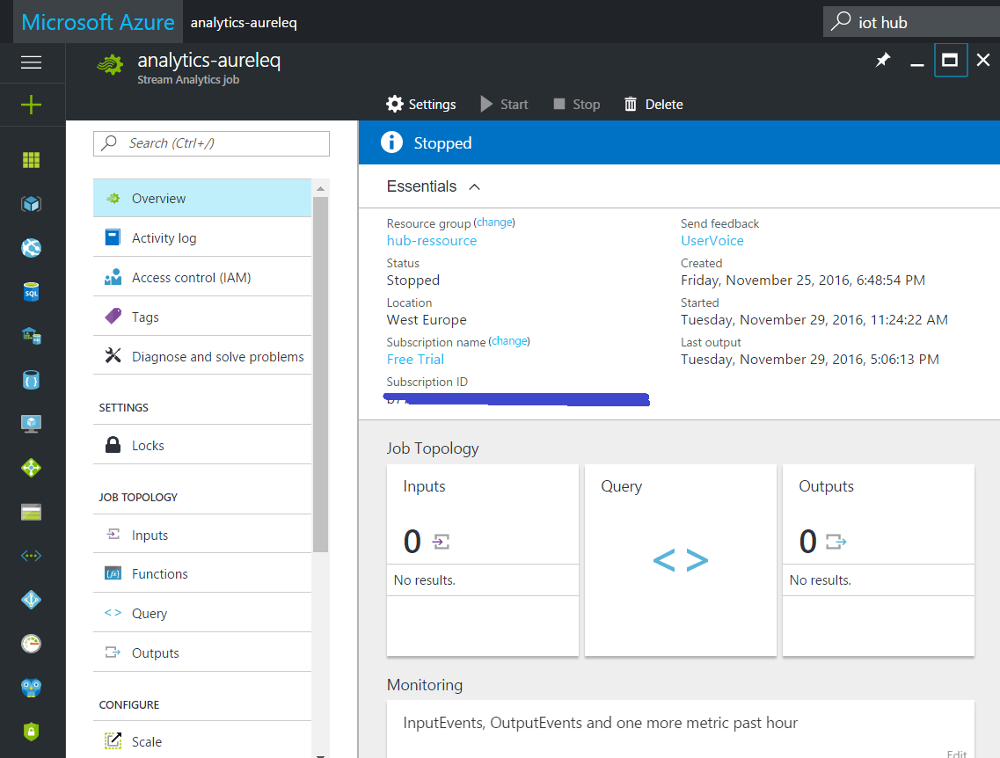

Add a new Input and select your IOT Hub instance as a source. Use default configuration for other fields as below:
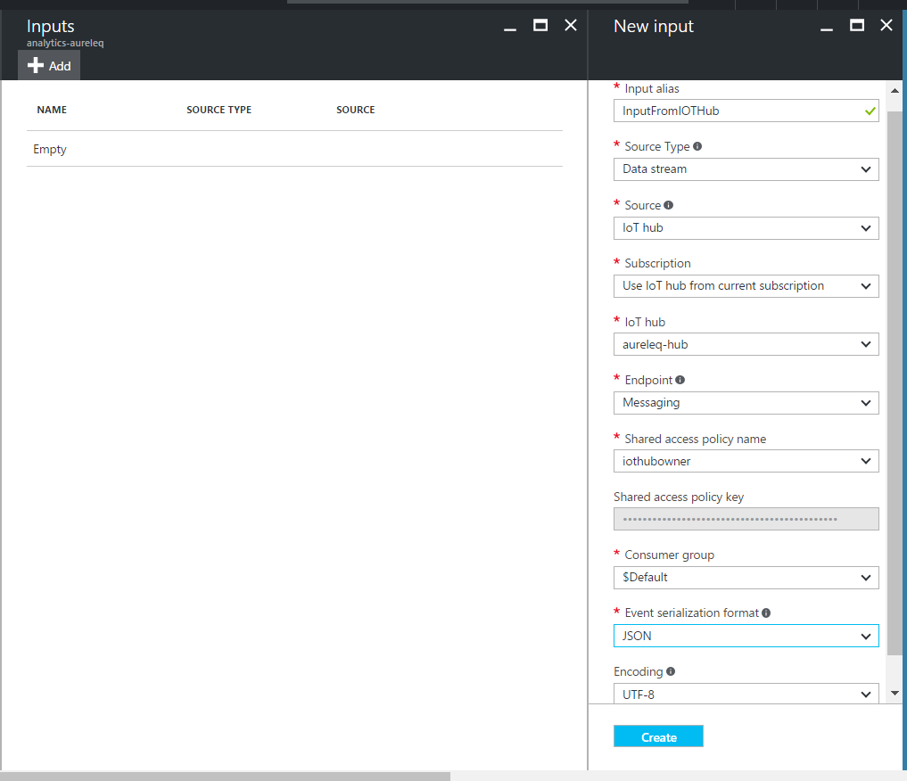

Add a new Output, select Power BI and authorize the connection to your Power BI account:
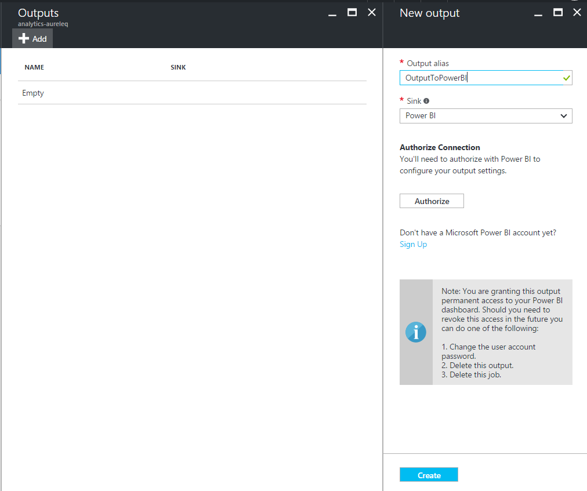

Create a new Dataset and Table that will be used to store messages information:
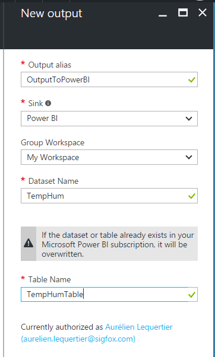

Finally, back on the Analytics dashboard create a new Query.
The query will take the date from the IOT Hub input and transfer it to our Power BI output. Humidity and Temperature values will also be converted to int and float values (our JSON callback report string values):
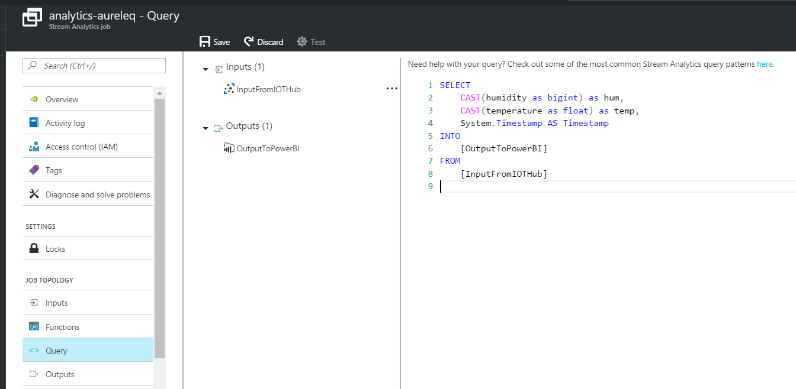

- Query content:
```sql
SELECT
    CAST(humidity as bigint) as hum,
    CAST(temperature as float) as temp,
    System.Timestamp AS Timestamp
INTO
    [DeviceBI]
FROM
    [DeviceInputStream]
```

## 6. Power BI visualization
Connect to your Power BI account (https://app.powerbi.com). Select the streaming dataset "TempHum" and edit it to define "hum" and "temp" as numbers.
Note that Power BI needs to receive at least one message to display the dataset:
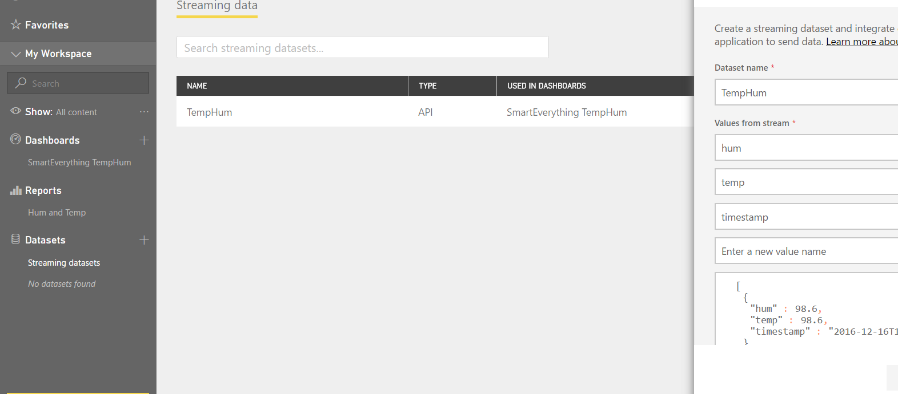

You can now create graphs from your dataset. Select a new Line Graph, simply drag and drop the timestamp variable on the Axis category and humidity/temperature variables to Values:
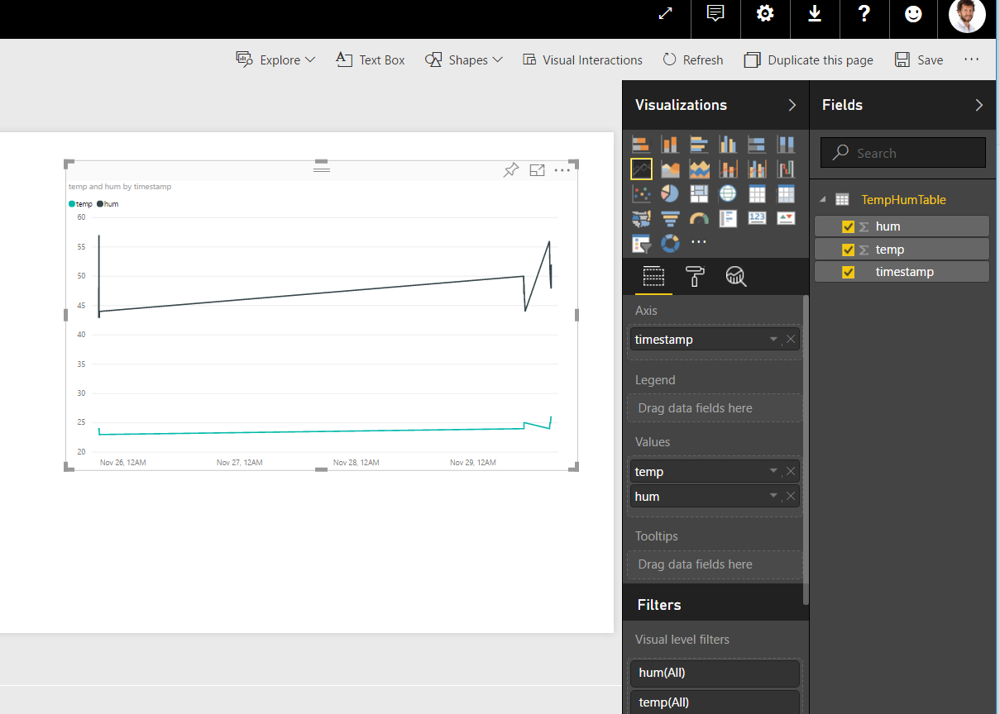

Once you are done with your graph presentation, you can save it and display it in the Reports and Dashboards sections:
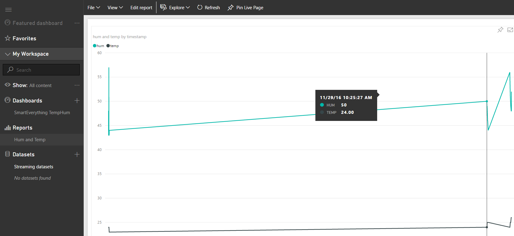
